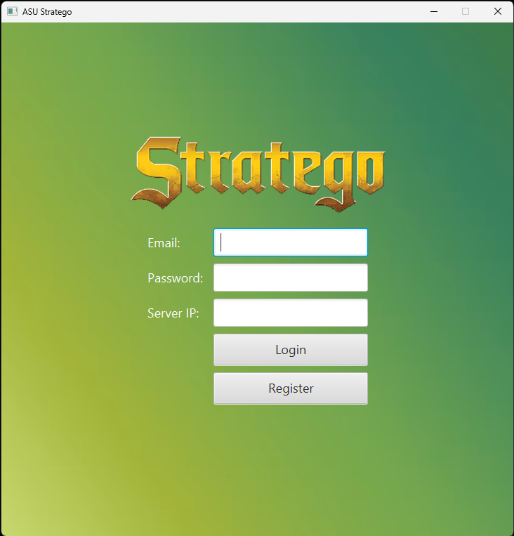
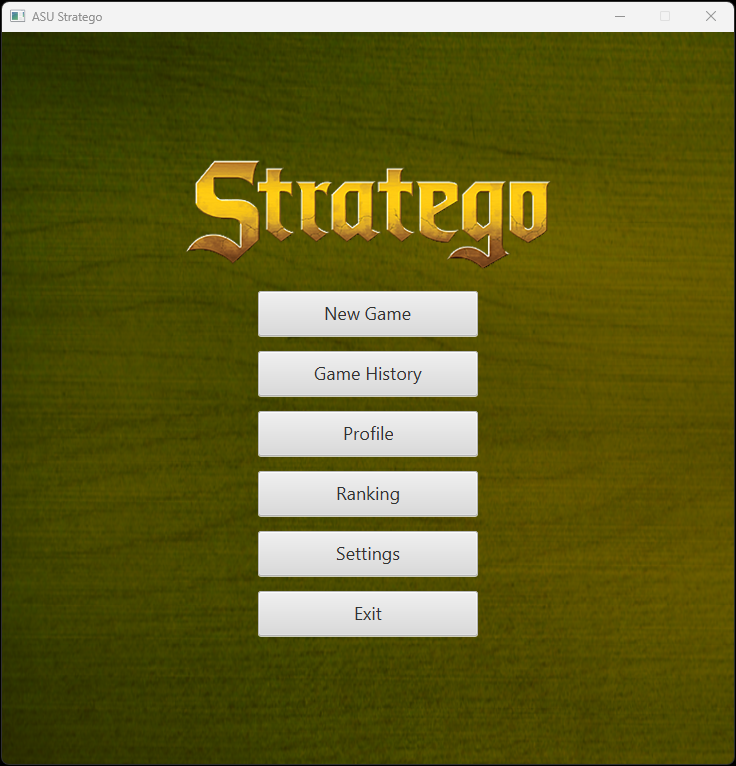
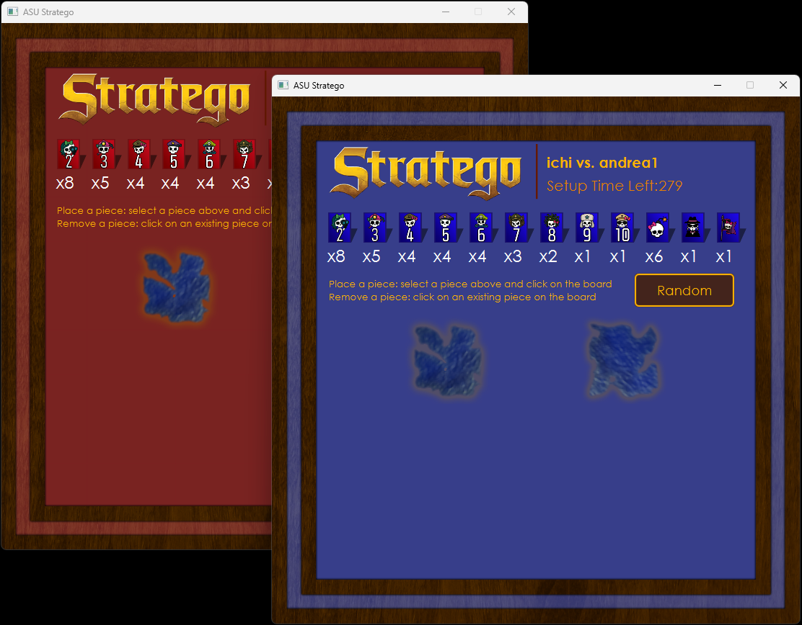
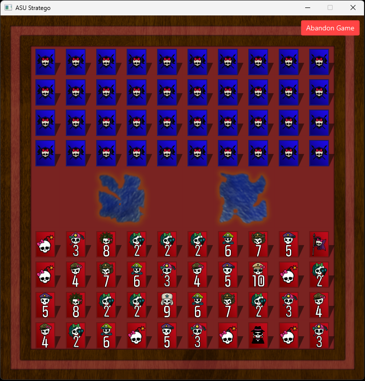
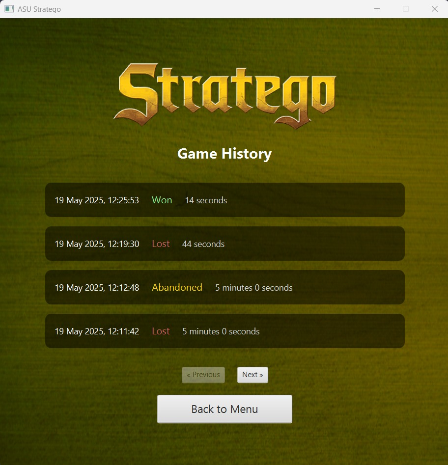
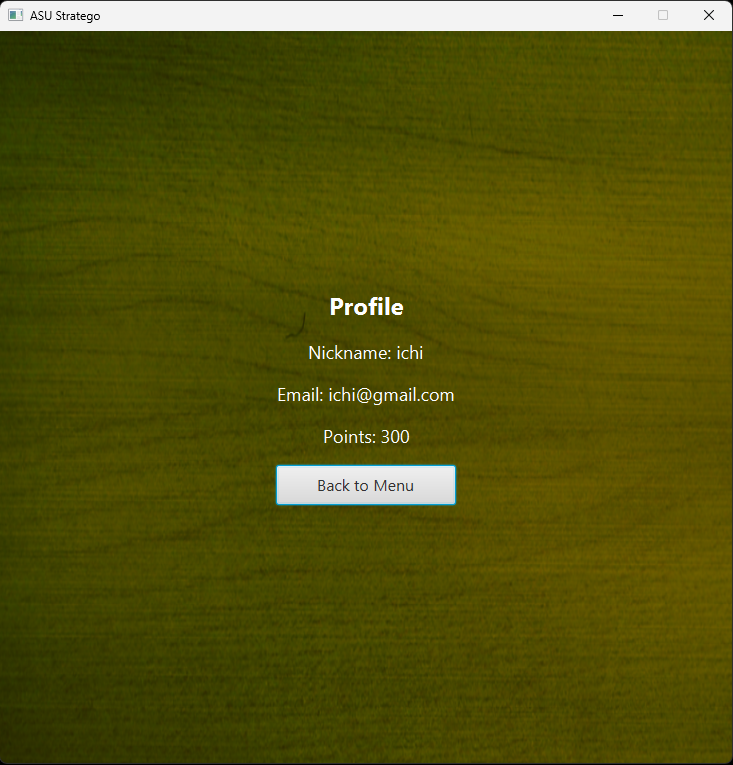
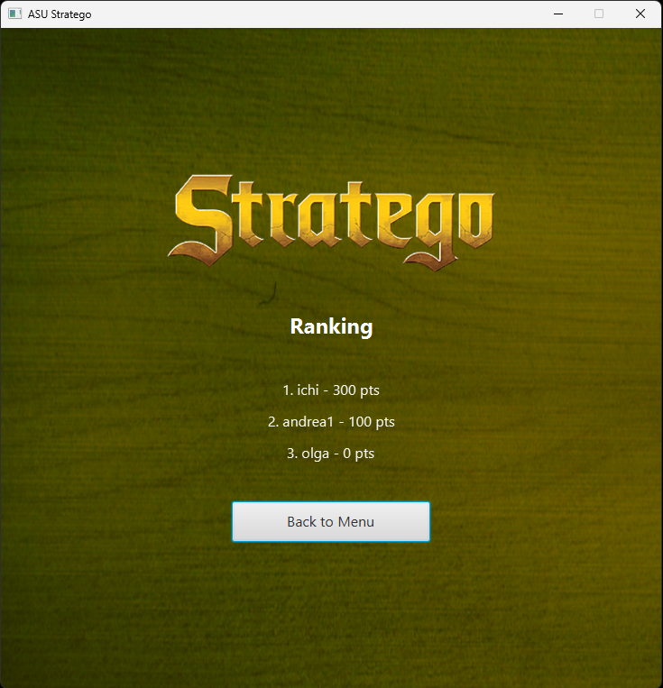
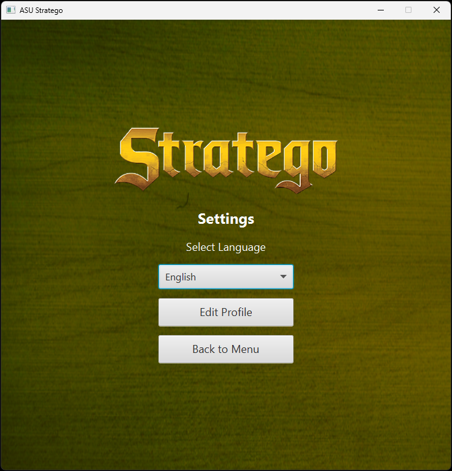
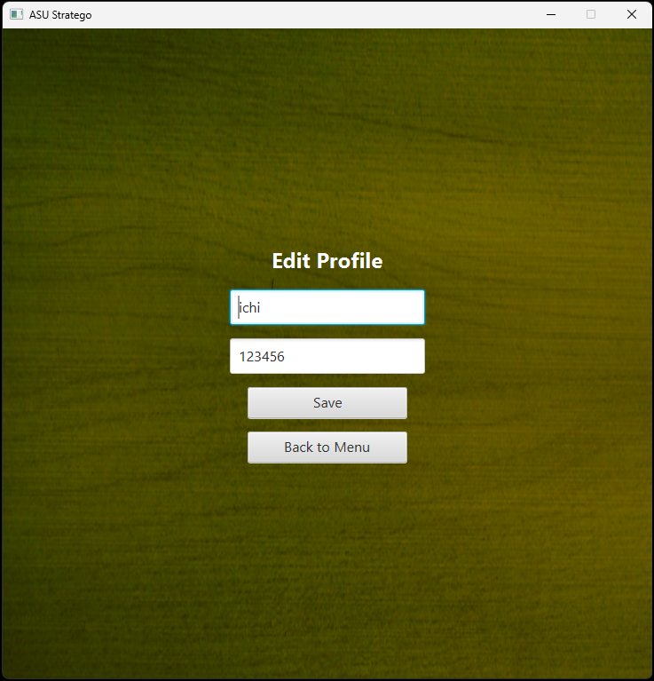
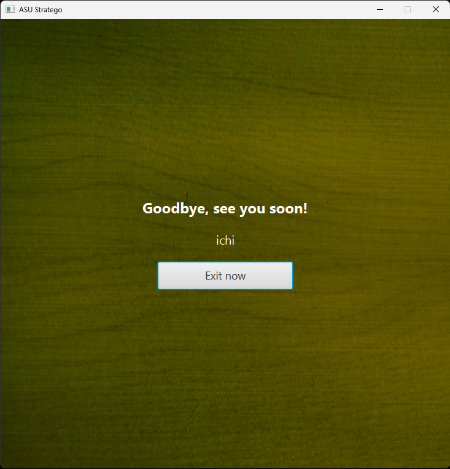

<div align="center">
    
</div>

---

> **Stratego** is a strategy board game for two players on a board of 10×10 squares. Each player controls 40 pieces representing individual officer ranks in an army. The objective of the game is to find and capture the opponent's *Flag*, or to capture so many enemy pieces that the opponent cannot make any further moves. *Stratego* has simple enough rules for young children to play, but a depth of strategy that is also appealing to adults

---


## 👩‍👩‍👦‍👦 TEAM MEMBERS

| Name and surname    | URJC mail      | GitHub user      |
|:------------: |:------------:| :------------:|
| Alexandra Carabus Verdes | a.cararus.2021@alumnos.urjc.es | alexandraaCS |
| Olga Chubinova Bortsova | o.chubinova.2022@alumnos.urjc.es | chubi0l |
| Andrea Garrobo Guzmán | a.garrobo.2022@alumnos.urjc.es | Garrobo08 |
| Icíar Moreno López | i.morenolo.2022@alumnos.urjc.es | IciarML |


##  🛠️ EXECUTION INSTRUCTIONS

1.  **Download the repository:**
    
    -   Clone or download this repository to your local machine
      
            ```
            $ git clone git://github.com/Sw-Evolution/Stratego.git
            $ cd Stratego
            $ git remote remove origin
            $ git remote add origin https://github.com/Sw-Evolution/25EXX.git
            $ git push -u origin master
            ```
      
2.  **Install Java 21:**
    
    -   If you don't have Java 21 installed, you can download it from the following link:  
        [Download Java 21](https://www.oracle.com/es/java/technologies/downloads/#java21)
        
3.  **Set up the database:**
    
    -   We are using XAMPP for the database, but you can use any SQL editor you prefer
    1.   Create a database named `stratego` and set the password `admin` for the `root` user
    2.   In the SQL Shell, run the following commands:
       
            ```
            CREATE DATABASE stratego;
            ALTER USER 'root'@'localhost' IDENTIFIED BY 'admin';
            ```
    
4.  **Run the project:**
   
    1.   Use Visual Studio Code and install the Spring Boot Extension Pack and Maven for Java extensions
    2.   Click the "Run" button in Visual Studio Code to start the server
    3.   Open a terminal and run the following command to launch the game:
       
            
            ```
            cd 25E07
            ```
            
            ```
            mvn clean javafx:run
            ```
            
    5.   Repeat step 3 on another terminal to launch the game for the second player
    6.   To access the game, each player must create an account and log in using the credentials they registered, along with the server IP address that appears in the terminal after executing step 2


## 📺 SCREENS
| Screen image | Screen name | Screen description |
|:------------:|:-----------:|:------------------:|
|  | Login | This screen is used by users to login using their credentials |
|  | Register | This screen allows users to create a new account |
|  | Menu | Main navigation screen to access all game options |
|  | Set Up Game | Screen to configure and start a new game |
|  | Game | Main gameplay screen where the match takes place |
|  | Game History | Displays a list of previously played games |
|  | Profile | Shows user profile information |
|  | Ranking | Shows the leaderboard with player scores and positions |
|  | Settings | Screen to change game settings and preferences |
|  | Edit profile | Screen where users can edit their personal data |
|  | Log out | Allows users to securely log out of the app |
